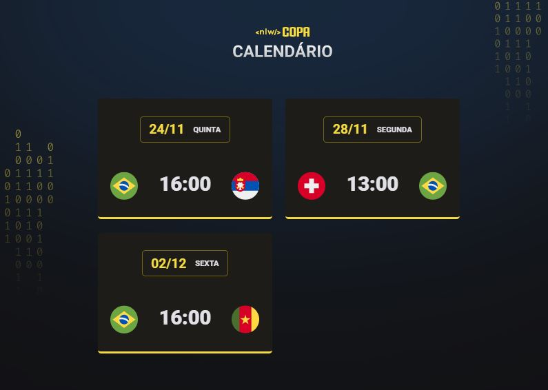

<h1 align="center"> NLW #10 COPA <h1>

Evento exclusivo e gratuito, promovido pela Rocketseat para ensino de tecnologias WEB.

  <a href="#-tecnologias">Tecnologias</a>&nbsp;&nbsp;&nbsp;|&nbsp;&nbsp;&nbsp;
<a href="#-projeto">Projeto</a>&nbsp;&nbsp;&nbsp;|&nbsp;&nbsp;&nbsp;
<a href="#-layout">Layout</a>&nbsp;&nbsp;&nbsp;|&nbsp;&nbsp;&nbsp;
<a href="#memo-Licença">Licença</a>;

  
  

   

  

  

## Tecnologias

Esse projeto foi desenvolvido com as seguinte tecnologias:

- HTML e CSS
- JavaScript
- Git e Github

## Projeto

O Calendário da Copa é um projeto que mostra os jogos do Brasil na fase de grupos da Copa do Qatar 2022.

## Layout

Você pode visualizar o layout do projeto através [DESSE LINK](https://www.figma.com/file/l6Bswqps1ZVr1LIdEdO5go/Calend%C3%A1rio-de-Jogos-(Community)?node-id=0%3A1).

## :memo: Licença

Esse projeto está sob licença MIT.
